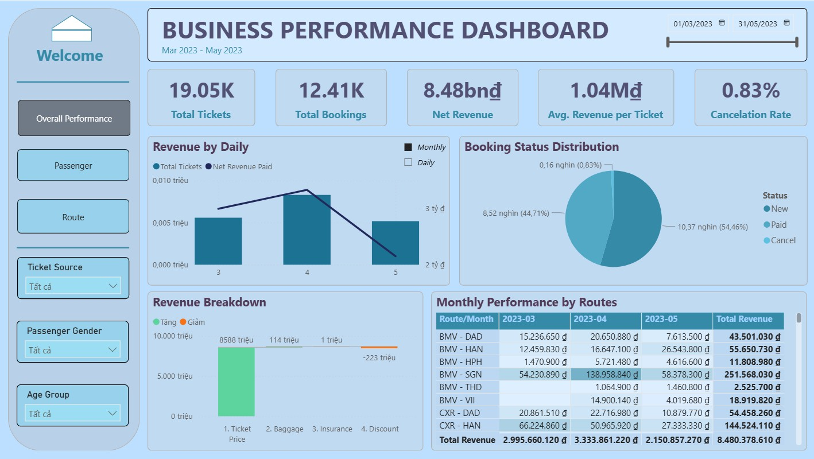
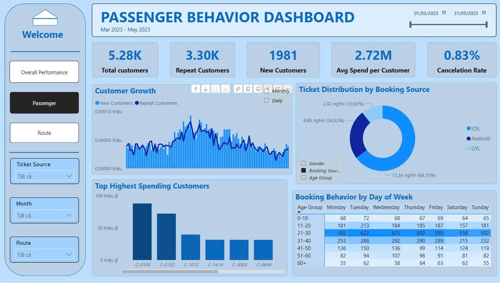
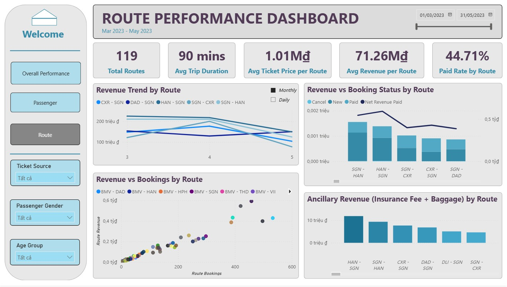

# 🚆 Train Ticket Sales Analysis

End‑to‑end analysis of ticket sales from March to May 2023, focusing on business performance, passenger behavior, and route economics for a national operator.

## 📌 Project Overview

The project uses transactional ticket data to quantify demand, revenue, and customer behavior across channels and routes.
Interactive Power BI dashboards summarize key KPIs to support decisions on pricing, capacity planning, and marketing.

## 🧭 Workflow: following CRISP-DM framework

   **1. Business understanding**  
   - Analyze train ticket sales to monitor revenue, demand, and customer behavior across channels and routes, supporting pricing, capacity, and product decisions.
   
   **2. Data understanding**  
   - Load the processed ticket dataset from Excel, inspect its structure, validate key fields, and profile distributions for booking status, channels, and routes.
   
   **3. Data preparation**  
   - Clean and standardize dates and categorical fields, and engineer analysis-ready features such as net revenue, age groups, and combined route codes.
   
   **4 Modeling (analytical exploration)**  
   - Use Python notebooks to study booking status, channel performance, route volumes, and passenger profiles, and to compute KPIs at daily, customer, and route levels for visualization.
   
   **5. Evaluation**  
   - Compare KPIs across channels, customer segments, and routes to identify high- and low-performing areas and confirm that results address the original business questions.
   
   **6. Deployment**  
   - Build three Power BI dashboards—Business Performance, Passenger Behavior, and Route Performance—with interactive slicers (ticket source, route, month, gender, age group) to deliver insights to stakeholders.
   - Include illustrative figures stored in the `/Figure` folder, for example:  
     -   
     -   
     - 

## Technologies Used

- **Python**: pandas, Matplotlib/Seaborn, Plotly for data wrangling and EDA in Jupyter Notebook.
- **Power BI Desktop**: interactive dashboards and KPI monitoring.
- **Excel**: storage for the processed ticket dataset consumed by both Python and Power BI.
- **Git & GitHub**: version control and project documentation.

## 🔍 Key Analytical Results

- **Overall performance (Mar–May 2023)**  
  - 19.05K tickets and 12.41K bookings generated 8.48bn₫ net revenue. 
  - Average revenue per ticket is 1.04M₫, with a low cancellation rate of 0.83%.

- **Channel performance**  
  - iOS contributes roughly two‑thirds of tickets (12.27K) and the highest total net revenue (~5.22bn₫).
  - GYL, while smallest in volume (2.00K tickets), achieves the strongest conversion rate (~65.6%) and the highest revenue per ticket.

- **Passenger behavior**  
  - 5.28K unique customers, including 3.30K repeat customers and 1,981 new customers, with an average spend of 2.72M₫ per customer.
  - The 21–30 age group accounts for 44.6% of tickets, making young adults the core customer segment.

- **Route performance**  
  - 119 active routes with an average trip duration of 90 minutes.
  - Average ticket price per route is 1.01M₫ and average revenue per route is 71.26M₫, with routes such as BMV–SGN and CXR–HAN among the top revenue generators (251.57M₫ and 144.52M₫ respectively over the period).
    
## 💡 Proposed Solutions

- **Channel optimization**  
  - Expand partnerships and marketing investment on high‑quality channels such as GYL, and replicate their best UX and messaging patterns on iOS and Android to improve conversion.

- **Pricing and revenue management**  
  - Use route‑level revenue metrics to refine pricing on top routes (for example HANOI–HCMC, NNG–HCMC, CXR–HCMC), protecting yield in peak months and applying targeted discounts only on softer periods and routes. 

- **Customer targeting**  
  - Prioritize campaigns for the 21–30 age segment and other high‑value groups, combining app‑based promotions and personalized offers to lift repeat purchases and average spend. 

- **Demand shaping over time**  
  - Launch recovery campaigns in softer months (e.g., May) focused on Thursday–Sunday travel, where revenue drops the most, while limiting broad discounts in strong months such as April.
- **Product and ancillary strategy**  
  - Promote baggage and insurance bundles on high‑traffic routes to grow ancillary revenue without materially lowering base fares.
    
## 🔮 Future Work

- Extend the time horizon and incorporate seasonality to build demand and revenue forecasts by route and channel.
- Develop customer segmentation and churn propensity models using demographic and behavioral features.
- Analyze price and promotion sensitivity to guide discount strategy and ancillary pricing.
- Automate data refresh and publish the Power BI dashboards for continuous monitoring in a production environment.

## 📂 Repository Structure

- `Data/` – Processed dataset and data dictionary (or link to source data).  
- `Preprocess/` – Jupyter notebooks for data cleaning and feature engineering.
- `Analysis/` – Jupyter notebooks for data exploration and analysis.
- `Reports/` – Exported Power BI dashboards (PDF) and Dashboard Power BI file (.pbix). `Booking Flow Analysis` specifies the data model, tracking events, tools, and key success metrics needed to monitor the end‑to‑end train booking journey, and presents a practical, experiment‑driven framework to diagnose funnel leaks and systematically improve conversion 
- `README.md` – Project documentation (this file).

Contributions and improvements to the analysis and dashboards are welcome.
